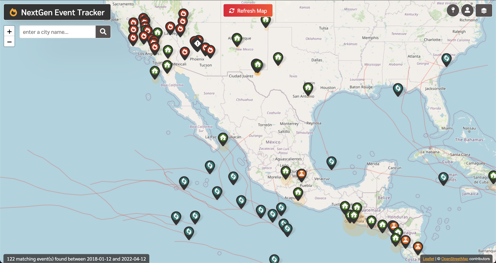

<h1 align="center"> Next Gen Event Tracker <h1>

## Description
A map tracking natural events across the globe, with a search bar to look for events in specific places, with the option to look for specific events within date ranges. Users can sign up for an account to gain access to submitting their own events to the database.

## Table of Contents
- [Description](#description) 
- [User Stories](#user-stories)  
- [Installation](#installation)
- [Contribution](#contribution)
- [License](#license)
- [Usage](#usage)
- [Built With](#built-with) 
- [Questions](#questions)
  
## User Stories
As a user, I want to view events for a specific area/region  
As a user, I want to have a profile specific user experience  
As a user, I want to submit an event into the database to contribute to the community.  
As a developer, I want to access community submitted events via api and use in my app.  

## Installation
1. update ./config/connection.js and the root/ .env as needed for your database info.
2. Run ./db/schema.sql using mysql console
3. Run npm i from terminal
4. Run npm run seed from terminal
5. Run npm start from terminal

## API Info
| Path                  | Method | Action                     | Requires                             |
|-----------------------|--------|----------------------------|--------------------------------------|
| /api/getAddressRoutes | GET    | return 1 lat lon coord.    | :textinput                           |
| /api/events/eonet     | POST   | return eonet api call data | JSON object                          |
| /api/events/usgs      | POST   | return usgs api call data  | JSON object                          |
| /api/events/userAdd   | POST   | adds event to application  | Not publicly accessible - "withAuth" |
| /api/events/userPull  | GET    | return all category data   | none                                 |

## Contribution
Thanks for your interest in contributing to the NextGen event tracker! We're constantly looking for ways to improve the project and any help is greatly appreciated. Check out our [Contribution Guidelines](https://github.com/n-r-martin/NextGen-event-tracker/wiki/Contribution-Guidelines "link to contribution guide") for ways to help out.

## License
 

This project is covered by MIT

## Usage
Can be found live [here](https://nextgen-event-tracker.herokuapp.com/ "link to heroku deployed app").

## Built With
Check out what we used to build our app [here](https://github.com/n-r-martin/NextGen-event-tracker/wiki/Built-with "link to built with page").

## Questions
If you have any questions or want to give us a shout out, look for us on GitHub at: 
- [Nick M](https://github.com/n-r-martin "Nick's link")  
- [Mike J](https://github.com/GittinIt6 "Nick's link")
- [Spencer K](https://github.com/Skerans "Spencer's link")

